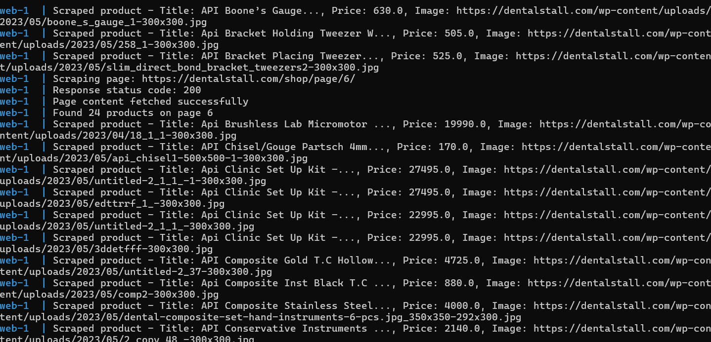

# Product Scraper

This project is a web scraping tool built using Python's FastAPI framework to scrape product information from a specified website. It fetches product titles, prices, and images, stores the scraped information in a JSON file, and prints notifications about the scraping status.

## Features

- Scrapes product titles, prices, and images.
- Handles pagination.
- Saves scraped data to a JSON file.
- Uses Redis for caching product prices.
- Provides a FastAPI endpoint to trigger the scraping process.
- API key authentication for the FastAPI endpoint.
- Notifies about the scraping status via console output.

## Prerequisites

- Python 3.7+
- Docker (for running Redis)
- Redis

## Setup

### 1. Clone the Repository

```sh
git clone https://github.com/kaushal-bhatt/Scraping-Tool
cd Scraping-Tool
```
### 2. Create a Virtual Environment
```
python -m venv venv
source venv/bin/activate   # On Windows use `venv\Scripts\activate`
```

### 3. Install Dependencies
```
pip install -r requirement.txt
```
### 4. Set Up Environment Variables
Create a .env file in the project root and add the following environment variables:
```
API_KEY=your-secret-api-key
REDIS_HOST=redis
REDIS_PORT=6379
REDIS_DB=0
DATABASE_FILE=products.json
```
### 5. Run Redis with Docker
Ensure Redis is running. You can use Docker to run Redis:
```
docker run --name redis -p 6379:6379 -d redis
```
## Running the Application

### 1. Run the FastAPI Application
```
uvicorn main:app --host 0.0.0.0 --port 8000
```

### 2. Trigger the Scraping Process
You can trigger the scraping process by sending a POST request to the /scrape endpoint. Use curl or Postman to send the request:
```
curl --location --request POST 'http://localhost:8000/scrape' \
--header 'X-API-Key: your-secret-api-key'
```

## Project Structure
```
.
├── main.py                 # FastAPI application entry point
├── scraper.py              # Scraper class definition
├── database.py             # JSONDatabase class definition
├── notifier.py             # Notifier classes definition
├── cache.py                # Cache class definition
├── config.py               # Configuration file
├── requirements.txt        # Python dependencies
└── README.md               # Project documentation
```


## Main Components
### Scraper
The Scraper class handles the web scraping logic, including pagination and extracting product information.

### JSONDatabase
The JSONDatabase class handles saving and loading product information to/from a JSON file.

### ConsoleNotifier
The ConsoleNotifier class handles sending notifications to the console.

### Cache
The Cache class handles caching product prices using Redis.

### FastAPI Endpoint
The FastAPI endpoint triggers the scraping process and integrates the scraper, database, notifier, and cache.

## Example Usage
Scrape Products: Sends a request to the /scrape endpoint to start the scraping process.

Check Results: Scraped data is saved to the specified JSON file and notifications are printed to the console.


##Output in Console

